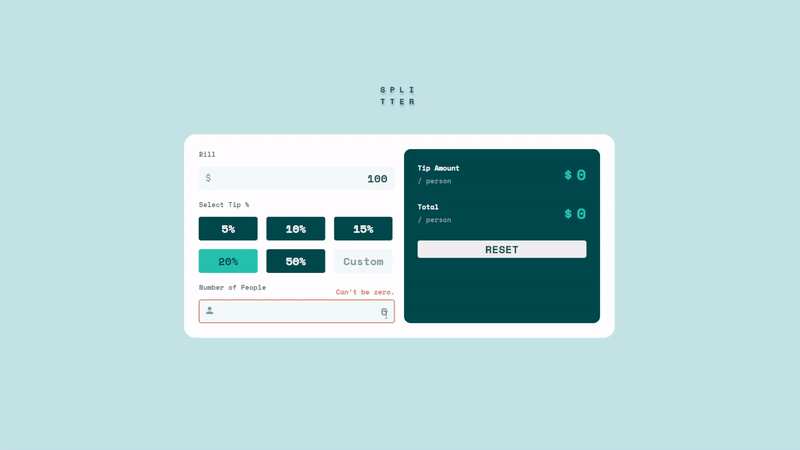

# Splitter

  

## ⚙️ Features

- Take user inputs and calculate tip and bill to split with friends
- Responsive design

## 📌 Lessons from the project

- To learn styling the `<form>` element and the `<input>` element
- To use Using media queries in Sass
- To create a working product by matching the [UI design](https://www.figma.com/file/5PgWPwUclOBDelMDqlYfIl/tip-calculator-app?node-id=0%3A1) as closely as possible.

## 💻 Technologies

- HTML
- SCSS
- JavaScript

## 🔨 Set up
- Download and install Git
- `> git clone https://github.com/chepark/splitter.git`
- Open `index.html` file on a browser.

